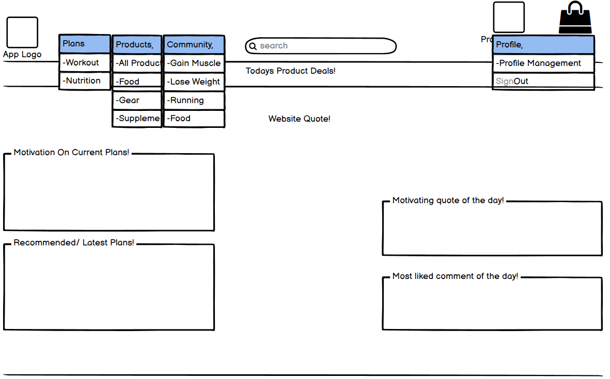

# Fit For All E-commerce Application

## Overview

**Fit For All** is an e-commerce platform that is for a wide range of users seeking a healthier and more active lifestyle. Our application uses a Business-to-Consumer (B2C) business model and serves as both an online retail store and a place to gather for fitness enthusiasts. Whether you're looking for fitness products or seeking inspiration to lead a healthier life, Fit For All has something for everyone.


### E-commerce Features

- **Online Retail Store**: Browse a diverse catalog of fitness products, all available using a quick and secure single payment option.

- **Content Marketing**: Get inspired by our informative food and fitness plans.

- **Fitness Community Platform**: Join our fitness community and share your experiences so you can connect with like-minded individuals.

### Web Marketing Strategy

Fit For All uses the following web marketing strategies:

- **Social Media Marketing**: We update our Facebook Page daily to keep our community up to date of our newest products, plans and exciting blogs.

- **Email Marketing**: We send out newsletters through **Mailchimp**, to keep our community updated of our latest content.

Fit For All helps you to achieve your fitness goals and live a healthier life. Join our community and explore our fitness products and resources. Welcome to the Fit For All family!

## Table of Contents
- [Strategy](#strategy)
    - [Target Audience](#target-audience)
    - [User Approach](#user-approach)
- [UX](#ux)
  - [User Stories](#user-stories)
    - [Visitor User Stories](#visitor-user-stories)
    - [Registered User Stories](#registered-user-stories)
    - [Admin User Stories](#admin-user-stories)
  - [Design](#design)
    - [Color Palette](#color-palette)
    - [Typography](#typography)
    - [Favicon](#favicon)
    - [Wireframes](#wireframes)
- [Data Scheme](#data-scheme)
- [Features](#features)
  - [Features](#features)
  - [Future-Implemented-Features](#future-implemented-features)
- [Technologies Used](#technologies-used)
  - [Front-End Technologies](#front-end-technologies)
  - [Back-End Technologies](#back-end-technologies)
- [Testing](#testing)
  - [Compatibility](#compatibility)
  - [Responsiveness](#responsiveness)
  - [Known Issues](#known-issues)
  - [Manual Testing](#manual-testing)
- [Deployment](#deployment)
  - [Local Deployment](#local-deployment)
  - [Remote Deployment](#remote-deployment)
- [Credits](#credits)
  - [Content](#content)
  - [Acknowledgements](#acknowledgements)
  - [Notes](#notes)

## Strategy

The development of the Fit For All project originates with the intent to address the needs of individuals and groups seeking a healthier and more active lifestyle. Our audience consist of a wide range of people with a shared commitment to fitness and wellness.

### Target Audience

**Fitness Enthusiasts**: For those who are interested in fitness and their well-being, We provide selection of fitness products, content, and a community platform to help them achieve their goals. Whether they are beginners or pro athletes, we aim to help them in their journey.

**Health-Conscious Individuals**: Fit For All is also designed for individuals who value their health and wellness. Our diet and workout plans, are made for those who wish to make informed and healthier choices in their lives.

**Community Seekers**: By having a community platform, we hope to encourage people to share their experiences, connect with other and find motivation and inspiration from each other.

### User Approach

We understand that each person's fitness journey is unique and of their own so we aim to provide the necessary content for a healthier way of life. Thus making the path of fitness a joy for everyone. Fit For All's goal is to help those who seek to lead a healthier, more active lifestyle.

## UX

### User Stories

The user stories have been separated by: Visitor, Registered User and Admin.

#### Visitor User Stories

- As a visitor/registered user, I want to be able to receive an online newsletter so that I can stay updated on the latest site updates and deals.

- As a visitor/registered user, I want to be able to view a 404 page so that I can understand that something went wrong.

- As a visitor/registered user, I want to be able to sort multiple categories of products simultaneously so that I can find the best-priced products across broad categories (Note: Sort by multiple categories functionality not yet applied, planned for the future).

- As a visitor/registered user, I want to be able to see what I've searched for and the number of results so that I can quickly decide if the product I want is available.

- As a visitor/registered user, I want to be able to sort a specified category of products so that I can find the best-priced products in a specific category.

- As a visitor/registered user, I want to be able to sort the list of available products so that I can easily identify the best-priced or specific products by name.

- As a visitor, I want to be able to receive an email after registering so that I can verify that my account registration was successful.

- As a visitor/registered user, I want to be able to view each individual plan/challenge's details so that I can identify the purpose, steps, and tips for each plan.

- As a visitor/registered user, I want to be able to view a list of plans so that I can choose one that suits me.

- As a visitor/registered user, I want to be able to view a list of products so that I can select the ones I'm interested in.

- As a visitor/registered user, I want to be able to view the number of likes and dislikes on each post and comment so that I can see which posts are the most popular (Note: Like/Dislike functionality currently hasn't been fully applied, planned for the future).

- As a visitor/registered user, I want to be able to view the details of the post and its comments so that I can interact with the content.

- As a visitor/registered user, I want to be able to view a list of posts so that I can select one to read.

#### Registered User Stories

- As a registered user, I want to be able to add products to my shopping cart so that I can continue shopping until I'm ready to check out my products.

- As a registered user, I want to be able to like and dislike posts and comments so that I can express my feelings about the community content (Note: Like/Dislike functionality not yet applied in the project, planned for the future).

- As a registered user, I want to be able to delete my own comments so that I can remove them if I'm dissatisfied with them.

- As a registered user, I want to be able to edit my own comments so that I can change the content if I change my mind.

- As a registered user, I want to be able to add comments so that I can share my thoughts on the posts.

- As a registered user, I want to be able to delete my own posts so that I can remove content I no longer agree with.

- As a registered user, I want to be able to edit my own posts so that I can modify the content to my liking.

- As a registered user, I want to be able to create my own posts so that I can contribute my own content to the application.

- As a registered user, I want to receive an email confirmation after checking out so that I can have a record of my purchases (Note: Confirmation of purchase functionality not completed, planned for the future).

- As a registered user, I want to be able to view an order confirmation after checkout so that I can verify that my order data is correct.

- As a registered user, I want to feel that my personal and billing information is safe and secure so that I can confidently provide the needed information to make a purchase.

- As a registered user, I want to enter my payment information so that I can check out quickly and without hassles.

- As a registered user, I want to be able to delete individual items in my shopping cart so that I can remove items I didn't actually want.

- As a registered user, I want to be able to change the quantity of individual items in my shopping cart so that I can easily make changes to my purchase before I check out.

- As a registered user, I want to be able to view the items in my shopping cart so that I can identify the total cost of my purchase and all the items I'll receive.

- As a registered user, I want to be able to select the quantity of a product when purchasing it so that I can avoid accidentally selecting the wrong amount.

- As a registered user, I want to have a personalized user profile so that I can check my billing information and order history.

- As a visitor, I want to be able to receive an email after registering so that I can verify that my account registration was successful.

- As a registered user, I want to be able to easily recover my password in case I forget it so that I can regain access to my account.

- As a registered user, I want to be able to log in and log out so that I can access the app's content and ensure the security of my information.

- As a visitor, I want to be able to register for an account so that I can have a personal account and access the products page of the app.

- As a registered user, I want to be able to easily view the total of my purchases at any time so that I can check the total value of items in my shopping cart.

#### Admin User Stories

- As an admin, I want to be able to delete all comments so that I can remove comments I deem inappropriate.

- As an admin, I want to be able to delete all posts so that I can remove posts I deem inappropriate.

- As an admin, I want to be able to delete products so that I can remove products that are no longer available.

- As an admin, I want to be able to edit products so that I can add relevant information to the products.

- As an admin, I want to be able to add products so that I can add items when new ones become available.

- As an admin, I want to be able to delete custom plans so that I can remove content if deemed irrelevant.

- As an admin, I want to be able to edit custom plans so that I can adjust content if deemed necessary.

- As an admin, I want to be able to create custom plans so that I can keep the content up to date for my application users.

### Design

For the designing of the the Fit For All application, we mainly focused on keeping it simple by using minimal colours so that the focus lays mainly on the interactive parts. The typography keeps the application look simple and easily accesible. The images and favicon icons have been provided to me by a dear friend of ours who will be referred to in the credits. The favicon icon uses the same colour pallette as the rest of the application to make it fit with the application itself. The idea was to not overload the user with too much stimuli thus keeping it inviting for any user. 

#### Color Palette

<div style="background-color: #db4c4c; width: 100px; height: 30px; display: inline-block; margin-right: 10px;"></div>
<div style="background-color: #f2f1f1; width: 100px; height: 30px; display: inline-block; margin-right: 10px;"></div>
<div style="background-color: #f2f1f1; width: 100px; height: 30px; display: inline-block; margin-right: 10px;"></div>
<div style="background-color: #f15f5f; width: 100px; height: 30px; display: inline-block;"></div>

- **Primary Color**: #db4c4c
- **Secondary Color**: #f2f1f1
- **Accent Color/Text Color**: #f2f1f1, #f15f5f

#### Typography

<style>
    .primary-font {
        font-family: 'Raleway', sans-serif;
    }
    .secondary-font {
        font-family: 'Roboto', sans-serif;
    }
</style>

- **Primary Font**: <span class="primary-font">Raleway</span>
- **Secondary Font**: <span class="secondary-font">Roboto</span>

#### Favicon

This is the custom favicon icon created by Thomas Huijbens.

Default 


32x32px


16x16px


#### Wireframes

In the early stages of developing the Fit For All application, we've created wireframes to start laying the founding of what we feel needs to be implied in this project and to serve as a blueprint for the design and development process. Please note that these are preliminary designs and some features may be different than in the final project. Balsamiq wireframes was used.

<strong>Home/Index Page</strong>



- The content of the home page has changed quite a lot from the initial wireframe. Instead of showing and motivation quotes or comments. We've decided instead that it would be better for the user experience to introduce all main section of the application.


<strong>Plans Main</strong>

- Later on in the development of the project, we've decided that for better user experience, we would create a main page to show each plans category instead of directly showing all plans with all categories combined. Thus there is no wireframe of this page.


<strong>Plans Category</strong>


- The plans category page has stayed mostly the same for the exception of the plans content which reverses its tags for each plan/challenge.The icon on the left was ment to display the intensity of the plan/challeng itself but has not been implemented.


<strong>Plans Details</strong>


- The plans/challenge details page content has mostly been applied but the review and checkbox functionality has not been applied. This is still considered a feature to be of value for future inplementation.

<strong>Products</strong>


- Products page features has been applied. Due to the sorting feature in the header, the category has not been added to the products itself.

<strong>Product Details</strong>


- The products details functionality has mostly been applied instead of the reviews. Will be applied in the future for increased value and user experience.

<strong>Blogs Main</strong>

- As the plans main page, the blogs main page has been added later on in the development of the project. We've decided that for better user experience, we would create a main page to show each blogs category instead of directly showing all blogs with all categories combined as the plans main page. Thus there is no wireframe of this page.

<strong>Blogs Category</strong>


- The blogs category page has stayed mostly the same for the exception of the blogs content which reverses its tags for each blog. The like/dislike functionality has not been applied but will be applied in the future.

<strong>Blogs Details</strong>


- The content of the blogs details page has stayed mostly the same as the wireframe but the like/dislike functionality has not been applied as of yet. The create post div is ment to be the div to add a comment. This has been applied.

<strong>Shopping Bag</strong>


- The shopping bag has been applied as the same maanner as the wireframe.

<strong>Checkout Page</strong>


- The checkout page has been applied as intended as shown on the wireframe.

<strong>Checkout Success Page</strong>


- The checkout success page has been applied as intended as shown on the wireframe but the optional gif has not been applied as we considered that this would not add a lot of value to the user experience.

<strong>Profile</strong>


- A lot of useful features for the user has not been applied as of yet to the profile page. But the most essential features such as the order history and billing information have been added.

<strong>Sign-in/Log-out</strong>


- The wireframe has been followed as intended but the app quote didn't seem essential at the time but can be applied in the future.

<strong>Sign-up</strong>


- The wireframe has been followed as intended but the app quote didn't seem essential at the time but can be applied in the future and no subscription feature has been applied for this app as it was decided that this was not the payment model.

<strong>Admin CRUD</strong>


- The wireframe has been taking for the basis of all main admin CRUD functionality. Each admin crud features has been changed for its intended purpose.

## Data Scheme

This data scheme shows an overview of the database structure and the relationships between different models in the project. This scheme helps you understand how the data is organized.


## Features

These are the features that currently exist in the Fit For All application project.

### User Management

1. **User Registration:** Visitors can create accounts with personal information.
2. **User Authentication:** Registered users can securely log in to their accounts.
3. **Password Recovery:** Registered users can recover their passwords if forgotten.
4. **Log-in and Log-out:** Registered users can access the application's content.
5. **User Profile:** Registered users have personalized user profiles.

### Product Management

6. **Product Selection:** Registered users can add products to their shopping bag.
7. **Sort Products:** Users can sort available products by category and different parameters through a filterbox option.
8. **View Bag Contents:** Registered users can view the items in their shopping bag and the total cost.
9. **Item Quantity Selection:** Registered users can choose the quantity of each product.
10. **Remove Items:** Registered users can delete items from their shopping bag.
11. **Change Item Quantity:** Registered users can adjust the quantity of items.
12. **Billing Information:** Registered users can set and update their personal and billing information.
13. **Order Confirmation:** Registered users receive an order confirmation after checkout.

### Blog and Community Interaction

14. **Comment Management:** Registered users can add comments, delete their comments, and edit their comments on posts.
15. **Post Management:** Registered users can create, delete, and edit their own posts.

### Content 

16. **View Posts:** Visitors and registered users can view a list of posts and select posts to read.
17. **Post Details:** Visitors and registered users can view the details of posts.
18. **View Plans/Challenges:** Visitors and registered users can view information about fitness plans and challenges.
19. **Plan/Challenge Selection:** Visitors and registered users can view a list of plans/challenges.

### Site Navigation and Email

20. **404 Page:** Visitors and registered users are directed to a 404 error page if something goes wrong.
21. **Online Newsletter:** Visitors and registered users can subscribe to an online newsletter to receive updates.

## Future-Implemented Features

The following features will be added in the future:

### Rating Posts and Comments

1. **Rating:** Registered users will have the ability to rate posts and comments.

### Reviewing Products and Plans

2. **Product Reviews:** Registered users can write reviews for products.
3. **Plan/Challenge Reviews:** Registered users can review plans/challenges.

### Sizes for Products

4. **Product Sizes:** Registered users can select sizes for products.

### Like/Dislike Functionality

5. **Like/Dislike Posts:** Registered users will be able to like and dislike posts.
6. **Like/Dislike Comments:** Registered users can like and dislike comments on posts.
7. **Like/Dislike Plans:** Registered users can like/dislike plans/challenges.
8. **Like/Dislike Products:** Registered users can like and dislike products.

### Pagination for Improved Navigation

9. **Post Category Pagination:** Registered users can navigate through the post categories page more easily with pagination.
10. **Plans Category Pagination:** Registered users can navigate through the plans categories page more easily with pagination.
11. **Post Comment Pagination:** Registered users can navigate through the comments of a post page more easily with pagination.

### Most Liked Functionality

12. **Most Liked Posts:** Registered users can view the most liked posts.
13. **Most Liked Comments:** Registered users can view the most liked comments.
14. **Most Liked Plans:** Registered users can view the most liked plans/challenges.
15. **Most Liked Products:** Registered users can view the most liked products.

### Email Confirmation

16. **Email Confirmation:** Users can receive email confirmations after checking out to keep records of their purchases.

## Technologies Used

These are the technologies used to build the Fit For All Project.

### Front-End Technologies

- **HTML & CSS:** Used for structuring of web pages and styling of the application.

- **JavaScript and jQuery:** Used for the interactivity of the application.

- **Balsamiq:** Used for wireframes.

- **Stripe:** Used for payment processingStripe is utilized for payment processing.

- **Amazon AWS:** Used for storing assets of the application.

- **Heroku:** Used for deploying the application.

### Back-End Technologies

- **Django Framework:** Used for easily usable features when building this application.

- **Python:** Programming language used to build this application.

- **Git and GitHub:** Used for managing source code.

- **ElephantSQL:** Used for its cloud-based database and managing of it.

- **Django Allauth:** Used for simply use of user authentication and registration processes.

## Testing

### Compatibility

The Fit For All project has been tested for compatibility on the following web browsers:

- Google Chrome
- Mozilla Firefox
- Microsoft Edge

All web browsers work accordingly.

### Responsiveness

For the responsiveness of this application, I used Bootstrap classes for their grid system and media queries. The primary bootstrap classes I utilized include:

- `col-lg`: Large screen layout.
- `col-md`: Medium screen layout.
- `col-sm`: Small screen layout.

These were used to ensure proper responsiveness for desktops, tablets, and mobile devices. It works as intended.

### Known Issues

**Plans/Challenge Containers:** The containers of the Plans/Challenge details dont seem to keep their width if the text content isn't long enough.

**Allauth Messages:** Difficulty linking messages to the allauth templates. Wasn't able to connect them properly.

**Allauth Indention:** Couldn't properly indent allauth templates like the other templates.

**Dropdown Menu Header:** When header is adjust to mobile view width. The dropdown menu won't show the dropdown items when hovered over.

### Manual Testing

Iv'e have tried to manual test as much as I possibly could and tried to keep the descriptions of the tests as simple and clear as possible.

1. **Adding Products to the Cart:**
   - **Test Case:** Registered users can add products to their cart.
   - **Expected Result:** Products are correctly added to the cart.
   - **Result:** Success.

2. **Newsletter Subscription:**
   - **Test Case:** Visitors and registered users can subscribe to the online newsletter.
   - **Expected Result:** Visitors and registered users receive email.
   - **Result:** Success.

3. **404 Page:**
   - **Test Case:** Fill in non-existing url.
   - **Expected Result:** A 404 page is displayed.
   - **Result:** Success.

4. **Managing Comments:**
   - **Test Case:** Registered users can delete and edit own comments.
   - **Expected Result:** Successfully delete and edit own comments.
   - **Result:** Success.

5. **Adding Comments:**
   - **Test Case:** Registered users can add comments to posts.
   - **Expected Result:** Comments are posted.
   - **Result:** Success.

6. **Managing Posts:**
   - **Test Case:** Test the ability to delete and edit own posts.
   - **Expected Result:** Successfully delete and edit own posts.
   - **Result:** Success.

7. **Create Posts:**
   - **Test Case:** Registered users can create posts.
   - **Expected Result:** Posts are created.
   - **Result:** Success.

8. **Order Confirmation:**
   - **Test Case:** Confirm that you can view the order confirmation.
   - **Expected Result:** Checkout success page is shown.
   - **Result:** Success.

9. **Entering Payment Information:**
    - **Test Case:** Test the process of entering payment information.
    - **Expected Result:** Payment information is stored and able to view.
    - **Result:** Success.

10. **Shopping Cart Management:**
    - **Test Case:** Verify the ability to delete items in your shopping cart.
    - **Expected Result:** Items removed successfully.
    - **Result:** Success.

11. **Viewing Cart Contents:**
    - **Test Case:** Confirm that you can view items in your cart with the total cost of purchase.
    - **Expected Result:** Displays of items and total cost.
    - **Result:** Success.

12. **Selecting Product Quantity:**
    - **Test Case:** Test selecting the quantity of a product when purchasing.
    - **Expected Result:** Quantity decrement and increment work accordingly.
    - **Result:** Success.

13. **Searching for Products:**
    - **Test Case:** Search for specific products as a visitor or registered user.
    - **Expected Result:** Search results match the products you're looking for.
    - **Result:** Success.

14. **Sorting by Specific Category:**
    - **Test Case:** Use header dropdown menu to sort products within a category.
    - **Expected Result:** Dropdown items show the desired results.
    - **Result:** Success.

15. **General Product Sorting:**
    - **Test Case:** Use searchbox option to sort products within a category.
    - **Expected Result:** Parameters show the desired results.
    - **Result:** Success.

16. **User Profile:**
    - **Test Case:** Access your personalized user profile as a registered user.
    - **Expected Result:** View your billing information and order history.
    - **Result:** Success.

17. **Email Confirmation for Registration:**
    - **Test Case:** Register for an account and verify successful account registration.
    - **Expected Result:** Receive a confirmation email.
    - **Result:** Success.

18. **Password Recovery:**
    - **Test Case:** Test the process of recovering your password as a registered user.
    - **Expected Result:** Regain access to your account.
    - **Result:** Success.

19. **Logging In and Out:**
    - **Test Case:** Verify successful login and logout.
    - **Expected Result:** Log-in/Log-out succesfull.
    - **Result:** Success.

20. **User Registration:**
    - **Test Case:** Register for an account as a visitor.
    - **Expected Result:** Gain access to the products details page.
    - **Result:** Success.

21. **Viewing Total Purchases:**
    - **Test Case:** As a registered user, easily view the total value of items in your shopping cart in the header.
    - **Expected Result:** Displays total purchases.
    - **Result:** Success.

22. **Viewing Post Details:**
    - **Test Case:** view the details of a post and its comments.
    - **Expected Result:** Post details page shown.
    - **Result:** Success.

23. **Viewing a List of Posts:**
    - **Test Case:** View a list of posts.
    - **Expected Result:** Post category page shown.
    - **Result:** Success.

24. **Viewing Plan/Challenge Details:**
    - **Test Case:** View the Plans/Challenge details page.
    - **Expected Result:** Content of page shown.
    - **Result:** Success.

25. **Viewing a List of Plans:**
    - **Test Case:** View a list of available plans/challenges.
    - **Expected Result:** Plans category page shown.
    - **Result:** Success.

26. **Viewing a List of Products:**
    - **Test Case:** As a visitor/registered user, attempt to view a list of available products.
    - **Expected Result:** Products page shown.
    - **Result:** Success.

27. **Deleting Comments:**
    - **Test Case:** As an admin, delete comments of registered users.
    - **Expected Result:** Successful comment removal of registered users.
    - **Result:** Success.

28. **Deleting Posts:**
    - **Test Case:** As an admin, delete posts of registered users.
    - **Expected Result:** Successful post removal of registered users.
    - **Result:** Success.

29. **Deleting Products:**
    - **Test Case:** As an admin, delete a product.
    - **Expected Result:** Product deleted.
    - **Result:** Success.

30. **Editing Products:**
    - **Test Case:** As an admin, edit a product.
    - **Expected Result:** Product information adjusted.
    - **Result:** Success.

31. **Adding Products:**
    - **Test Case:** As an admin, add a product.
    - **Expected Result:** Successfully added a product.
    - **Result:** Success.

32. **Deleting Plans:**
    - **Test Case:** As an admin, remove a plan.
    - **Expected Result:** Successfully removed plan.
    - **Result:** Success.

33. **Editing Plans:**
    - **Test Case:** As an admin, edit a plan.
    - **Expected Result:** Accurate content adjustment.
    - **Result:** The content containers of the plans details page seems to not take on the correct width. Needs to be adjusted in future.

34. **Creating Plans:**
    - **Test Case:** As an admin, create a plan.
    - **Expected Result:** Successfully created a plan/challenge.

## Deployment

### Local Deployment (GitPod)

1. **Create Repository**
   - Created a new repository on GitHub for the Fit For All project.

2. **Install Django**
   - Ran the following command to install Django:
     ```
     pip3 install django
     ```

3. **Install Gunicorn**
   - Installed Gunicorn using:
     ```
     pip3 install gunicorn
     ```

4. **Install Psycopg2**
   - Installed psycopg2 using:
     ```
     pip3 install psycopg2
     ```

5. **Create `requirements.txt`**
   - Generate a `requirements.txt` for project's dependencies:
     ```
     pip3 freeze --local > requirements.txt
     ```

6. **Create Django Project**
   - Initialize your Django project with:
     ```
     django-admin startproject Fit-For-All.
     ```

7. **Create App**
   - Create a new app within project with:
     ```
     python3 manage.py startapp fit_for_all
     ```

8. **Add App to `settings.py`**
   - In project `settings.py`, add app to the `INSTALLED_APPS` list.

9. **Migrate Changes**
   - Apply database migrations with:
     ```
     python3 manage.py makemigrations
     python3 manage.py migrate
     ```

10. **Push Changes to GitHub**
    - Add your project files to your local Git repository, commit changes, and push them to your GitHub repository.

11. **Verify Skeleton**
    - Run the development server:
      ```
      python3 manage.py runserver
      ```
    - Verify that the project's skeleton has been built successfully.

### Remote Deployment (Heroku)

1. **Create a Heroku App**
   - Signed in to Heroku.
   - Created a new Heroku app.

2. **Create an ElephantSQL Database**
   - Signed up for ElephantSQL.
   - Create a new PostgreSQL database instance for the fit for all project.

3. **Create `env.py` with Secret Variables**
   - Created an `env.py` file in project and stored secret variables such as `SECRET_KEY`, `DATABASE_URL`, Stripe keys, Amazon AWS keys, etc.

4. **Modify `settings.py`**
   - Modified project `settings.py` to use the variables from `env.py` and enable the use of the ElephantSQL database and other services.

5. **Set Up Static and Media Files**
   - Configure your project to serve static files and media files. Ensured i had Amazon AWS credentials for hosting media and static files.

6. **Migrate to Databases**
   - Applied database migrations for the ElephantSQL database:
     ```
     python3 manage.py makemigrations
     python3 manage.py migrate
     ```

7. **Set Up Heroku Config Vars**
   - In Heroku app's settings, add config vars with the same keys as in your `env.py` file.


## Credits

### Content

I would like to thanks of own of my closest friends [Thomas Huijbens](https://www.thomashuijbens.net/) for helping me get the artwork I wanted for this project. Thomas Huijbens is a graphic designer based in the Netherlands who was able to provide me with some amazing (and quite experimental) artwork. Without him this project would have not been the way I wanted it to be. Finally I also want to thank all my friends and family for encouraging me to continue working on this course during challenging times. Without them I wouldn't have had the strength to finish the final milestone project. I hope with all my heart that I am able to complete this course with a diploma so they can be proud of me and especially me of myself. It has been a long journey but I feel that I have learned an amazing and intriguing skillset that I am able to build a bright career out of. Thank you to code institute for also giving me the time and space to finish all the projects and being understanding of my situation.

### Acknowledgements

I've used source code of the boutique ado project and adjusted it where necessary for my own project.

The main source code I used from boutique ado is:

#### Products

-views, models, forms

#### Checkout

-views, signals, models, forms

#### Bag

-views, contexts, bag_tools, quantity_input_script

### Notes

- Due to this project being drawn out over a long time, I haven't been consistent in the use of my user stories. I want to add that I understand how they should be used and that in upcoming projects I will be more pragmatic in the use of them.

- I haven't added any "nofollow" or "sponsored" rel attributes to any links because none of my links come from any paid links or any distrusted content as all links refer to my own contant or facebook/mailchimp which is a trusted source. Also, none of my links are sponsored or compensated.

- Due to a lack of time I haven't been able to run all my code through all validators(html,css,js) but I have tried to reduce as many python errors using flake8. Will run all code through all validators in the future.

- These are images of my Facebook page for Fit For All:


